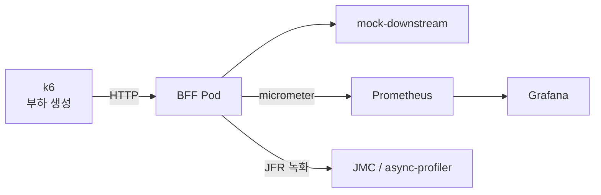

# 도구 선정

## 부하 테스트 도구

| 도구 | 언어 | 장점 | 단점 |
|------|------|------|------|
| **k6** | JS (Go 엔진) | 스크립트 간결, CI 연동, Prometheus export | 플러그인 생태계 제한적 |
| Gatling | Scala/Java | DSL 직관적, HTML 리포트 | Scala 학습곡선, 고급기능 유료 |
| JMeter | Java | GUI, 프로토콜 폭넓음 | 무거움, 대규모 부하 시 자체 리소스 큼 |
| Locust | Python | Python으로 작성, 분산 쉬움 | GIL 한계 |
| wrk2 | C + Lua | 극도로 가벼움, 정밀 latency | 시나리오 제한 |

## 모니터링/메트릭

| 도구 | 용도 |
|------|------|
| **Prometheus** | 메트릭 수집/저장. k8s 표준, Spring Boot Actuator 연동 |
| **Grafana** | 대시보드/시각화. k6 + JVM 메트릭 A/B 비교 |
| **cAdvisor** | 컨테이너 리소스 (CPU, Memory, Network per container) |
| **Micrometer** | 애플리케이션 메트릭 계측. Spring Boot 내장 |

## JVM 프로파일링

| 도구 | 용도 |
|------|------|
| **JFR** | JVM 내장 상시 프로파일링. 오버헤드 <2%, Virtual Thread 이벤트 추적 |
| **async-profiler** | CPU/Allocation/Lock 프로파일링. flame graph. VT 지원 |
| **JMC** | JFR 녹화 파일 GUI 분석 |
| jstat / jcmd | GC, 힙, 스레드 CLI 확인 |

## 최종 추천 조합

| 역할 | 도구 | 이유 |
|------|------|------|
| 부하 생성 | **k6** | Go 엔진이라 가벼움, JS 스크립트, Prometheus remote write |
| 메트릭 수집 | **Prometheus + Micrometer** | Spring Boot Actuator → Prometheus가 자연스러운 조합 |
| 시각화 | **Grafana** | k6 + JVM 메트릭을 한 대시보드에서 A/B 비교 |
| JVM 프로파일링 | **JFR + async-profiler** | JFR 상시 수집, async-profiler 집중 분석. 둘 다 VT 지원 |
| 컨테이너 리소스 | **cAdvisor + Prometheus** | pod 단위 CPU/Memory 추적 |

### 최소 구성 (빠르게 시작)

1. **k6** — 부하 생성
2. **JFR** — JVM 프로파일링 (설치 불필요, JVM 내장)
3. **jstat** — GC/힙 모니터링 (CLI)

이 3개만으로 throughput, latency, GC, 스레드 수 비교 가능. Prometheus/Grafana는 이미 있으면 연동.
